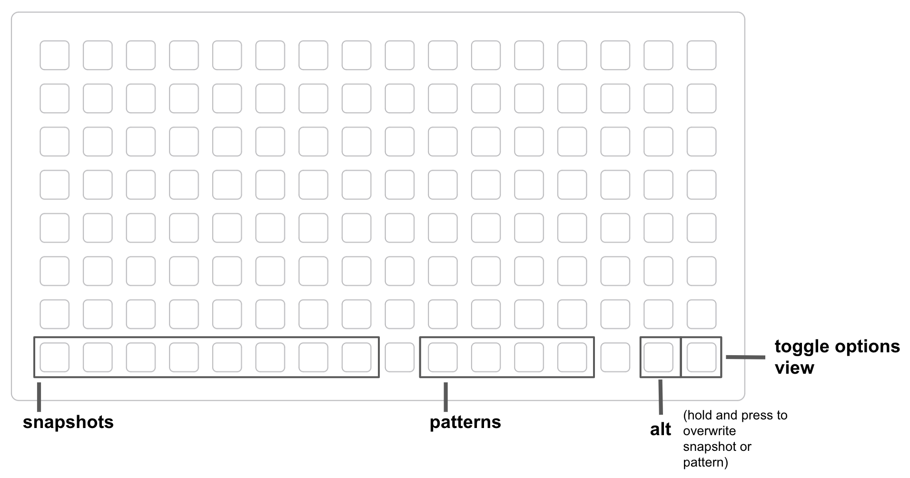
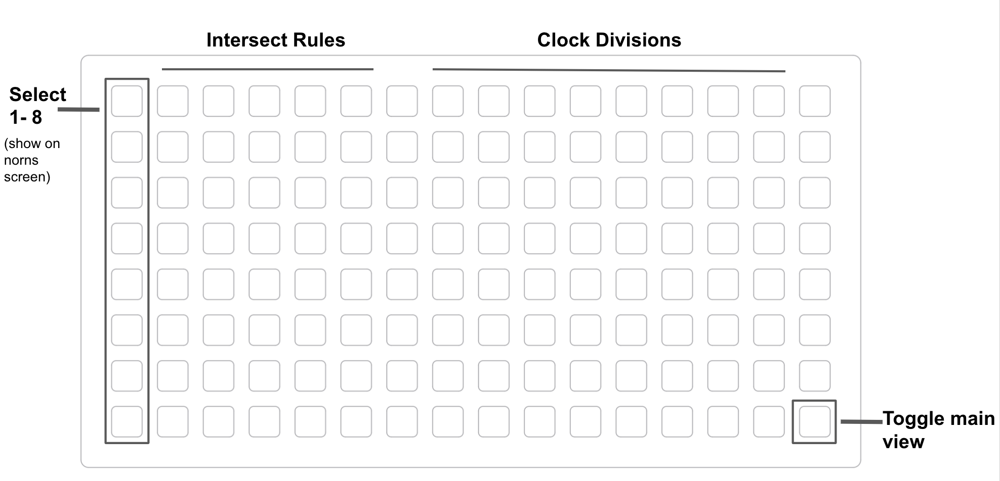

# Animator

2D Polyphonic step sequencer. Draw sequencers across both axes and trigger events when they intersect.

## main view

Hold two pads in the main view (anywhere but the far right column) to draw a sequencer. Pads can be oriented vertically, horizontally, or diagonally, but must connect with a straight line.

Whichever pad you pressed first will determine the direction of your sequencer. 

Press any pad on your new sequencer to activate that note. 

Hold the first and last pad of your sequencer to clear it (you can also clear it from the options view).

There is a max of 8 sequencers. If you go over the max, they will be replaced in "first in first out" order  (so the 9th sequence will replace the first, 10th will replace the 2nd, etc).

Press a snapshot button to store the current state. 

## options

Use the far left column to select sequencers 1-8. The sequencer will display on the norns screen. 

The next 5 columns are intersect rules:

1. Octave - Transpose 1 octave up for each intersect
2. Mute - mute note
3. Reset Self - reset self to step 1
4. Reset Others - reset all intersects except self to step 1
5. Reset All - reset every sequencer to step 1

If multiple sequencers intersect and play an active note at the same time, intersect rules are triggered. Rules are off for each sequencer by default.

N.B. - If 1 sequencer is set to "octave," and another sequencer is set to "mute" at intersect, "mute" will take precedence.

Columns 8-15 are per sequence clock divisions (divs 1 - 8 from left to right). 

## Norns Keys/Encoders

E2 - move all sequencers across the Y axis  
E3 - move all sequencers across the X axis

K2 - Reset all sequencers (or selected sequence if on options view)  
K3 - Clear all sequencers (or selected sequence if on options view)

## Presets
Save and load presets using "save doodle" and "load doodle" options from the parameters menu. When loading, load the file with the ".doodle" extension.

## Other Parameters

Additional parameters accessible via norns parameters menu include:

* LFOs - Modulate sequencer positions (fun for semi-generative sounds)
* Output - audio (internal synth), midi, or Just Friends via crow and I2C
* Slop - delay playback of each note by random ms (parameter sets the max delay amount)
* min/max velocity (random velocity between min and max) 
* min/max note length (random note length between min and max)
* max notes - limit the max number of notes that can play at once
* scale and global transposition
* Option for separate midi channel per sequencer

